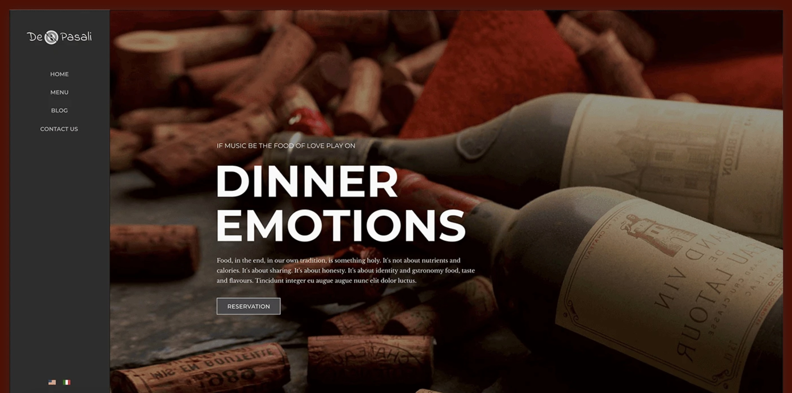
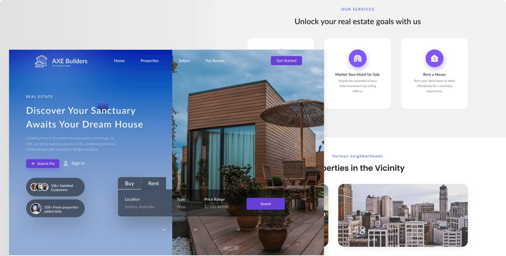
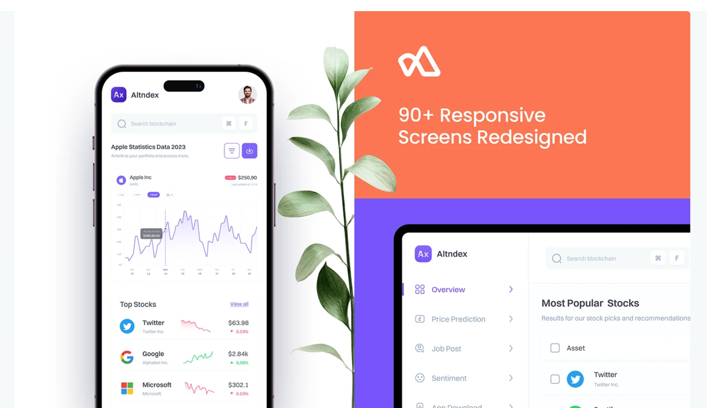

# Projects { .page-title }

:::: {.project-card}
::: {.columns}
::: {.column width="50%"}

### Dinner Emotions: UX/UI Design for Seamless Navigation

A dining experience shaped through thoughtful UX/UI design. Clean navigation, clear user flows, and intuitive interactions help users move effortlessly through every step.

[View Project](https://www.behance.net/gallery/213674183/Dinner-Emotions-UXUI-Design-for-Seamless-Navigation){.btn}

:::
::: {.column width="50%"}

{fig-alt="Project preview" style="width:100%; height:100%; object-fit:cover; min-height:280px;"}

:::
:::
::::

:::: {.project-card}
::: {.columns}
::: {.column width="50%"}

{fig-alt="Project preview" style="width:100%; height:100%; object-fit:cover; min-height:280px;"}

:::
::: {.column width="50%"}

### Real Estate Website: UX/UI Redesign for User Engagement

A modern UX/UI redesign created to make property browsing more intuitive, engaging, and user-friendly. The experience focuses on clear navigation, better usability, and stronger user interaction.

[View Project](https://www.behance.net/gallery/213675325/Real-Estate-Website-UXUI-Redesign-for-User-Engagement){.btn}

:::
:::
::::

:::: {.project-card}
::: {.columns}
::: {.column width="50%"}

### Stock Market App: UX/UI Redesign for Usability

A modern stock market app redesign built to improve usability and reduce complexity. Every screen is designed to make tracking, analyzing, and trading feel easier and more intuitive.

[View Project](https://www.behance.net/gallery/213673819/Stock-Market-App-UXUI-Redesign-for-Usability){.btn}

:::
::: {.column width="50%"}

{fig-alt="Project preview" style="width:100%; height:100%; object-fit:cover; min-height:280px;"}

:::
:::
::::